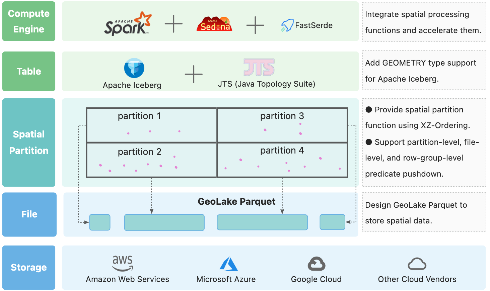

# GeoLake

**GeoLake** aims at bringing geospatial support to lakehouses.



Note: We develop GeoLake atop Apache Iceberg, preserving the committed history of Apache Iceberg in the process. This retention explains the extensive contributor list on our project. Maintaining the commit history facilitates easy tracking of the changes within the Apache Iceberg project, enabling us to rebase our code to the latest version of Iceberg and ensure compatibility with its new releases.

## GeoLake Architecture

GeoLake can be used to build a lakehouse with geospatial support. It is built on top of [Apache Spark](https://spark.apache.org/) and [Apache Iceberg](https://iceberg.apache.org/).

- **GeoLake Parquet**: A extension to Apache Parquet to support geospatial data types.
- **Spatial Partition**: A spatial partitioning scheme for Apache Iceberg.
- **Geometry Type**: A geometry type for Apache Iceberg.
- **Spark & Sedona**: Integrate with Apache Spark and Apache Sedona seamlessly.

## Spark SQL Examples
```sql
-- Create table with a geometry type, as well as a spatial partition
CREATE TABLE iceberg.geom_table(
    id int,
    geom geometry
) USING ICEBERG PARTITIONED BY (xz2(geo, 7));

-- insert geometry values using WKT
INSERT INTO iceberg.geom_table VALUES
(1, 'POINT(1 2)'),
(2, 'LINESTRING(1 2, 3 4)'),
(3, 'POLYGON((0 0, 0 1, 1 1, 1 0, 0 0))');

-- query with spatial predicates
SELECT * FROM iceberg.geom_table
WHERE ST_Contains(geom, ST_Point(0.5, 0.5));
```

## Quickstart

Check this repo [docker-spark-geolake](https://github.com/spatialx-project/docker-spark-geolake) for early access, there are some [notebooks](https://github.com/spatialx-project/docker-spark-geolake/tree/main/spark/notebooks) inside.


